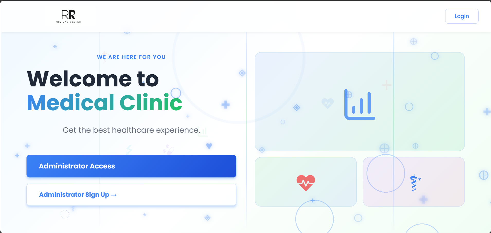
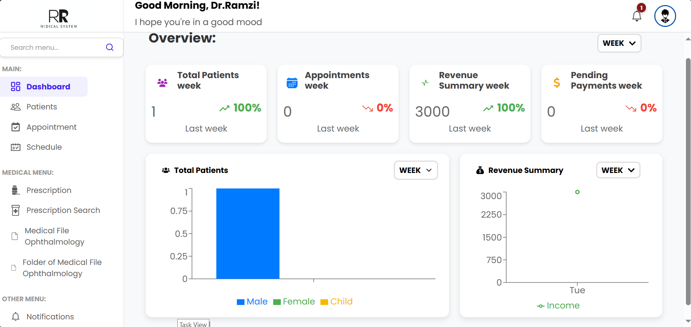
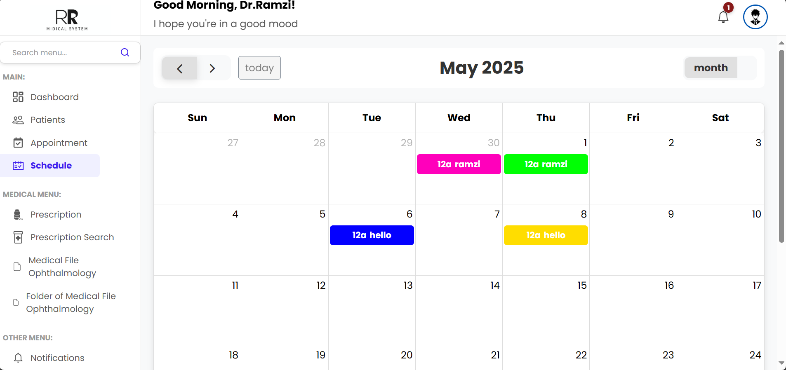
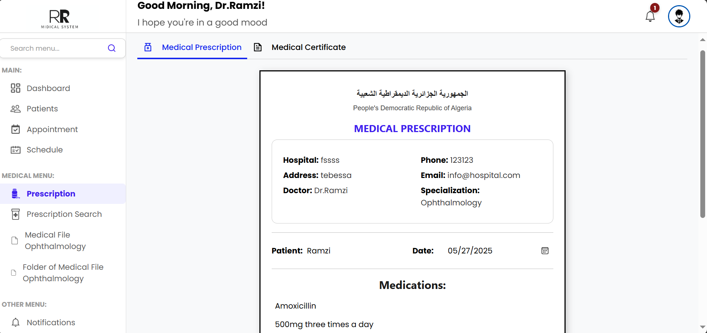
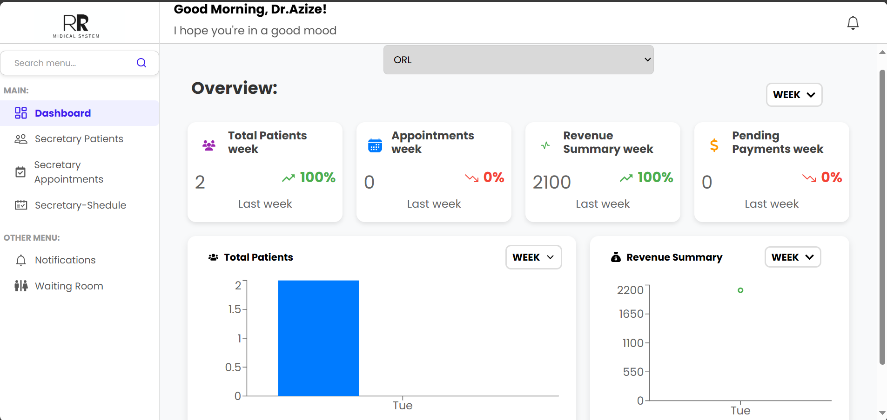
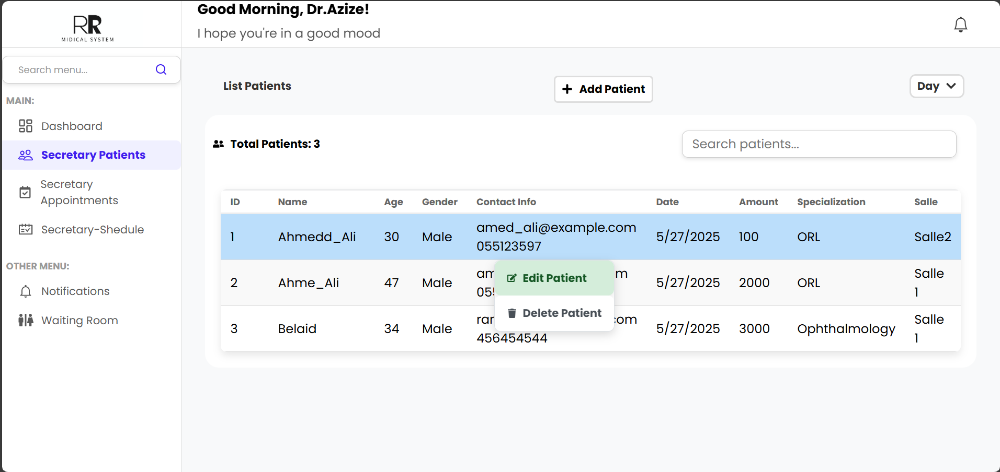
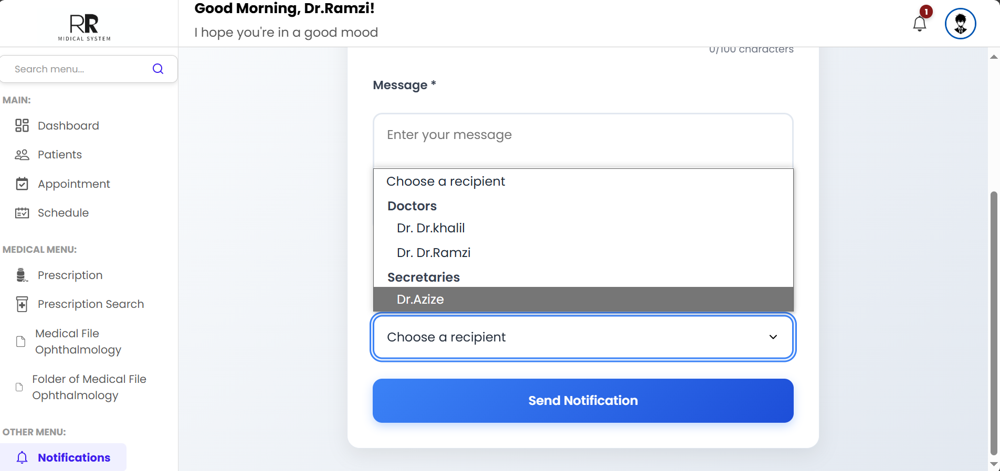

# Medical System Management

## Description
A React + Node.js project to manage a medical clinic system, including appointments, patient records, dashboards for doctors, secretaries, and administrative management. Demonstrates practical skills in web development, database management, and role-based access control.

## Project Features
- **Admin Panel:**
  - Add and manage doctors
  - Add and manage secretaries

- **Doctor Panel:**
  - Fill and manage personal schedule
  - View and manage appointments
  - Access and update patient medical records
  - Create prescriptions (ordonnances)
  - Issue medical certificates
  - View notifications
  - Profile management

- **Secretary Panel:**
  - Verify and manage doctor's schedule
  - Manage patient appointments
  - Manage patient basic records
  - Organize doctor rooms
  - View notifications

- **Common Features:**
  - Notifications system for all roles
  - Responsive user interface
  - Role-based access control

## Project Screenshots
### Home Page


### Dashboard for Doctor


### schudel for Doctor


### Presprcption for Doctor


###  Profile for Doctor


### Dashboard for secrtary


### Patient Management


### Notifications Example


## Technologies
- **Front-end:** React, HTML, CSS, JavaScript  
- **Back-end:** Node.js, Express  
- **Database:** MongoDB  
- **Others:** Axios for API calls, JWT for authentication

## How to Run Locally
1. Clone the repository:  
   ```bash
   git clone https://github.com/Ramzi-Belaid/midical-system.git
